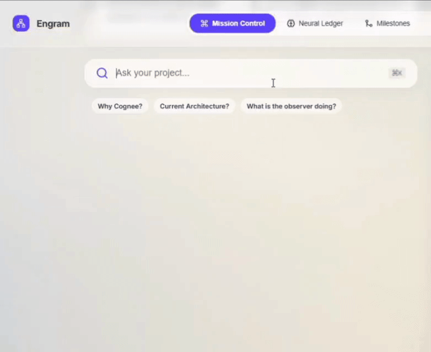

# Engram

*Architected and engineered solo by @pratham-hub1 for the WeMakeDevs Hangover AI Hackathon.* 

[Watch the 3-Minute Demo Video](https://youtu.be/KBjiBrCANG8?si=ptA44Wtrn5Ra2sk7)

---

*Code tells you what changed. Project memory tells you why.*

Every AI coding assistant forgets your project the moment the session ends. Engram doesn't. It runs quietly in the background, watches your commits, docs, and decisions, and builds a persistent knowledge graph of *why* your project looks the way it does — powered by [Cognee](https://www.cognee.ai).

Ask it a question. 

Every answer includes the evidence trail that produced it. It answers with the commit, the doc, or the decision that backs it up.

Traditional search retrieves documents.

Engram reconstructs engineering decisions by traversing the relationships between commits, documentation, files, and developer notes. Cognee makes those relationships persistent instead of treating them as isolated chunks of text.

---

## The Problem

You explain your project to an AI assistant. You close the tab. Tomorrow, you explain it again.

Six months from now, someone asks why the auth system was redesigned. The commit is there. The reasoning isn't. It lived in a Slack thread, a standup, someone's memory — and none of that survives.

Code survives. The reasoning doesn't. That's the gap.

The goal isn't to remember code.
It's to preserve engineering decisions before they disappear.

---

## See It Work

> 

Engram doesn't guess. It walks the graph — decision → commit → docs → files — and shows you the path it took to get there.

---

## Why Cognee, Not Just RAG

| | Traditional RAG | Engram (via Cognee) |
|---|---|---|
| **Unit of retrieval** | Document chunks | Connected nodes (decisions, commits, files, docs) |
| **Answers "what changed"** | Yes | Yes |
| **Answers "why it changed"** | Rarely — the reasoning is usually spread across sources | Yes — traverses the chain that produced the change |
| **Multi-hop questions** | Poor — returns the single best-matching chunk | Native — follows relationships across hops |
| **Answer grounding** | Loosely similar text | Traceable path back to source evidence |
| **Hallucination Risk** | High — LLM guesses when chunks lack context | Grounded Answers — Evidence-backed through graph traversal and source tracing |
| **Privacy / Execution** | Often sends massive, unorganized chunks to cloud APIs | 100% Local Graph — Only targeted reasoning prompts leave your machine 

RAG is built to find *a* relevant paragraph. Engram is built to find *the chain* that explains a decision. Cognee is the piece that makes that chain queryable — a persistent graph memory layer, not a magic reasoning engine. Engram's job is the reasoning on top; Cognee's job is making the connections exist in the first place.

---

## What Engram Captures

- Git commits
- Documentation changes
- Configuration updates
- Structural code elements (file imports, key classes, and functions)
- Developer decision notes

All of it flows into Cognee and becomes part of one graph. When you ask a question, Engram answers from that graph — and shows the evidence, not just a conclusion.

- *Why did we replace Flat RAG?*
- *Why was authentication redesigned?*
- *What changed last week?*
- *If I joined today, where should I start?*

If Engram can't trace an answer back to something concrete in the graph, it doesn't present it as fact. That's the whole trust model.

---

## Built On Its Own Memory

The reasoning trace you see in this README is Engram's actual development history, captured by Engram while it was being built. Not seed data. Not a staged demo. 

We used the product to remember why we built the product. If it didn't work, we'd have noticed first.

---

## Core Features

**Answers come with receipts.** Every response points back to the commit, doc, or note behind it.

**Relationships, not documents.** Questions that span a decision, a commit, and the files it touched get answered as one connected chain.

**Architecture evolution, visualized.** Structural changes over time render as an explorable graph, not a changelog you have to reconstruct by hand.

**Disappearing knowledge gets flagged.** Engram detects "ghost decisions" — meaningful changes with no recorded intent — and nudges you before the reasoning is lost for good.

**Runs on your machine.** Graph storage and traversal are fully local. Only reasoning extraction makes an external call.

---

## Why This Matters

Engineering context loss isn't hypothetical — it's the reason onboarding takes weeks, why teams re-litigate settled decisions, and why "who knows why we did this" is a routine standup question.

- **Engineering teams** stop re-deriving context every time someone touches unfamiliar code.
- **Startups** move fast and document nothing — until the one person who remembers the tradeoff leaves. Engram captures the reasoning as a side effect of normal work, not extra process.
- **Long-lived products** accumulate decisions faster than anyone can track by hand. A graph connecting decisions to the code they produced turns "we think this is why" into "here's the commit and the note."
- **New hires** get a project they can interrogate directly instead of a stale onboarding doc.
- **AI coding assistants** write code well and understand *why* the codebase looks the way it does poorly. Engram is the memory layer underneath them.

---

## Architecture

```
[ Developer Works ] ──> [ Background Observer ]
                                │
                       [ Event Intelligence Pipeline ] ──> [ NVIDIA Gateway Sidecar ]
                                │                               (Schema Translation)
                        [ Cognee Knowledge Graph ]
                                │ (SQLite + LanceDB + KuzuDB)
                                │
                        [ FastAPI Core Backend ]
           ┌────────────────────┴────────────────────┐
           │                                         │
  [ Dashboard (React + D3) ]              [ MCP Server (experimental) ]
  Production-ready today                  Foundation laid, not demo-ready
```

Two ways knowledge enters the graph:

1. **Passive.** Commits, config changes, and docs are captured and linked automatically as they happen.
2. **Active.** When Engram detects a meaningful architectural change with no documentation behind it, it nudges the developer to log a short decision — bound directly to the relevant code nodes.

---

## Architecture Principles

A few decisions shape everything else in this project. They're worth stating explicitly, because they explain *why* the architecture looks the way it does, not just *what* it does.

**Local-first.** Graph storage and traversal run entirely on the developer's machine. Project memory shouldn't require sending a codebase to a third-party server to be useful. The only thing that leaves the machine is the payload for reasoning extraction — nothing else.

**Evidence over confidence.** Engram is built to say "I don't know" rather than produce a fluent answer with no source behind it. Every answer traces back to a commit, a doc, or a decision note. If that trace doesn't exist, the answer doesn't get presented as fact. This is a harder product to build than one that just sounds confident, and it's the reason the graph structure matters more than the model generating the response.

**Continuous memory, not point-in-time snapshots.** Engram doesn't index a project once and go stale. It observes continuously, so the graph reflects the current state of the project as of the last commit, not the state it was in when someone last ran an ingestion job.

**Human-in-the-loop for what machines can't infer.** Some context can be extracted automatically — imports, commit messages, file structure. The *reasoning* behind a decision usually can't be. Engram doesn't try to fabricate intent it doesn't have; it detects the gap and asks the person who has the answer.

---

## Engineering Challenges We Solved

**NVIDIA's NIM API and Cognee's expected schema don't match.** We built a small translation layer between them, isolated from the main event loop, so a slow reasoning call never stalls graph ingestion.

**A stale graph is worse than no graph.** Trusting whatever state was left after the last shutdown caused rate-limit flooding on reboot. Engram now verifies graph consistency against Cognee on every startup before resuming.

**A full project graph doesn't render in a browser.** Past a trivial size, pulling the entire graph freezes the UI. Engram serves a pruned subgraph — recent activity wired into core architectural nodes — so rendering stays under a second regardless of project size.

**Local-first, by design.** Graph storage and traversal run entirely on your machine. Only the reasoning call leaves — nothing else does.

---

## Engineering Decisions & Trade-offs

Every architecture involves choices that trade one property for another. These are the ones worth being explicit about.

**Three storage engines instead of one.** SQLite, LanceDB, and KuzuDB each do one job well — relational state, vector similarity, and graph traversal, respectively. A single database could handle all three less well than three specialized ones handle it separately. The cost is operational surface area: three stores to keep in sync instead of one, which is why startup verification against Cognee exists at all.

**A decoupled reasoning gateway instead of a direct integration.** Routing NVIDIA calls through a standalone FastAPI sidecar instead of calling the API directly from the main service adds a network hop. In exchange, the main event loop never blocks on a slow external call, and the translation logic between OpenAI-style payloads and NIM's schema lives in one place instead of being scattered through the ingestion pipeline.

**A pruned subgraph instead of the full graph.** Rendering the complete graph gives a more complete picture but doesn't scale — past a small project size, it stops being legible in a browser at all. Engram trades completeness for a subgraph that's fast and readable, built from recent activity wired into core architectural nodes. The trade-off is that very old or peripheral relationships won't show up in the default view.

**Lightweight relationship extraction instead of full static analysis.** Structural relationships (`auth.js` imports `db.js`) are inferred from import statements and file structure rather than a full AST parse. This is faster and covers the common case without adding a heavy parsing dependency, at the cost of missing some deeper structural relationships a complete static analyzer would catch.

**Nudging for decisions instead of inferring them.** Engram could try to generate a plausible explanation for an undocumented change using the LLM. It doesn't, because a fabricated decision is worse than a missing one — it looks like ground truth and isn't. Flagging the gap and asking the developer costs a small amount of friction in exchange for not polluting the graph with invented reasoning.

---

## Dashboard

| View | Purpose |
|---|---|
| **Mission Control** | High-level synthesis of recent activity, live. |
| **Ask Your Project** | Ask a question, see the reasoning path behind the answer. |
| **Neural Ledger** | Log decisions manually; browse what's been captured. |
| **Milestones** | Watch the architecture graph change shape over time. |
| **Memory Health** | What's being tracked, and how large the local graph is. |

---

## Quick Start

**Prerequisites:** Python 3.11+, Node.js 18+, an NVIDIA API key.

```bash
git clone https://github.com/your-username/engram.git
cd engram
python -m venv .venv
# Activate virtual environment (Windows): .venv\Scripts\activate
# Activate virtual environment (Mac/Linux): source .venv/bin/activate
cp .env.example .env
# Add NVIDIA_API_KEY=your_key to .env
pip install -r requirements.txt
```

```bash
# Terminal 1 — gateway
uvicorn backend.gateway:app --host 127.0.0.1 --port 5001 --reload

# Terminal 2 — main service
uvicorn backend.main:app --host 127.0.0.1 --port 8000 --reload
```

```bash
# Terminal 3 — frontend
cd frontend
npm install
npm run dev
```

Visit `http://localhost:5173`. First boot backfills your codebase; every boot after that is instant.

**MCP (experimental, alpha):** structurally built, still being stability-tested, not part of the primary demo.

```json
{
  "mcpServers": {
    "engram": { "url": "http://localhost:8001/mcp" }
  }
}
```

---

## Project Structure

Reflects the entry points referenced above; some subpackages are grouped for brevity.

```
engram/
├── backend/
│   ├── main.py              # Primary FastAPI service — graph queries, dashboard API
│   ├── gateway.py           # NIM gateway sidecar — schema translation, port 5001
│   ├── observer/            # Watchdog-based file & git event capture
│   ├── pipeline/            # Event intelligence — filtering, relationship extraction
│   ├── cognee_integration/  # Cognee client, graph read/write, startup verification
│   └── mcp/                 # MCP server (experimental)
├── frontend/
│   ├── src/
│   │   ├── views/           # Mission Control, Ask Your Project, Neural Ledger, Evolution, Memory Health
│   │   └── components/      # Graph visualization (D3), shared UI
│   └── package.json
├── .env.example
└── pyproject.toml
```

---

## API Overview

A non-exhaustive list of the endpoints that matter for understanding how the dashboard talks to the backend. Full surface lives in `backend/main.py` and `backend/gateway.py`.

| Endpoint | Method | Purpose |
|---|---|---|
| `/api/graph/summary` | GET | Returns the pruned, render-ready subgraph for the dashboard |
| `/api/query` | POST | Natural-language question → graph traversal → evidence-backed answer |
| `/api/decisions` | POST | Log a manual decision from the Neural Ledger, bound to code nodes |
| `/api/health` | GET | Local database sizes and observer status, for Memory Health |
| `/mcp` (experimental) | — | MCP server entry point, not part of the primary demo |

The NIM gateway (`backend/gateway.py`, port 5001) is internal — it isn't called directly by the frontend, only by the ingestion pipeline when it needs a reasoning or embedding call.

---

## Under the Hood: How We Use Cognee

We didn't want to build another AI wrapper around a vector database. Engram is architected around Cognee's complete memory lifecycle.

Instead of using Cognee only for retrieval, we built our ingestion, optimization, retrieval, and cleanup pipelines around its four core primitives: `remember()`, `improve()`, `search()`, and `forget()`.

### `remember()` — Deterministic Memory Ingestion

Every captured event (commits, documentation updates, configuration changes, structural relationships, and developer decisions) enters the graph through `cognee.remember()`.

Rather than relying on randomly generated IDs, Engram creates deterministic UUIDs from file hashes before ingestion. This prevents duplicate graph nodes, eliminates phantom memories across rescans, and keeps the graph stable over long-running projects.

---

### `improve()` — Background "Dream Cycle"

Running graph optimization after every filesystem event makes ingestion slower and wastes reasoning calls.

Instead, Engram decouples `cognee.improve()` into a scheduled background "Dream Cycle". The observer keeps capturing events while graph optimization happens asynchronously, allowing the memory graph to continuously improve without blocking the developer workflow.

---

### `search()` — Multi-Hop Graph Recall

The "Ask Your Project" experience is powered by Cognee's graph traversal instead of traditional similarity search.

```python
from cognee.modules.search.types.SearchType import SearchType
import cognee

async def recall_memory(query: str, dataset_name: str, system_prompt: str):
    """
    We don't search for disjointed documents.
    We search for the chain of reasoning.

    Decision → Commit → Documentation → File
    """

    results = await cognee.search(
        query_text=query,
        query_type=SearchType.GRAPH_COMPLETION, # Graph traversal, not just vector match
        system_prompt=system_prompt,
        datasets=[dataset_name]
    )

    return results
```

Instead of retrieving isolated document chunks, `GRAPH_COMPLETION` traverses connected nodes inside the knowledge graph. Engram then parses the returned reasoning path and renders it in the UI as evidence-backed "receipts", allowing users to see exactly how an answer was derived.

---

### `forget()` — Self-Healing Memory Cleanup

When files disappear or noisy events should no longer exist inside project memory, Engram calls `cognee.forget()` using the same deterministic UUID generated during ingestion.

This keeps the graph synchronized with the real project instead of allowing stale or orphaned memories to accumulate over time.

---

## Tech Stack

| Layer | Technology | Role in the Architecture |
|---|---|---|
| Background observation | Watchdog | Detects file system and git events as they happen |
| Event processing | Custom event-intelligence pipeline | Filters noise, extracts structural relationships before anything hits the graph |
| Knowledge graph | Cognee 1.2.2 | Persistent memory layer — stores and connects decisions, commits, docs, and files |
| Graph traversal | KuzuDB | Multi-hop relationship queries over the graph |
| Vector search | LanceDB | Similarity search for retrieval within the graph |
| Relational state | SQLite | Local metadata, activity logs, dashboard-facing state |
| Reasoning | NVIDIA Nemotron | Generates the reasoning trace behind an answer |
| Embeddings | NVIDIA embeddings | Vectorizes captured content for retrieval |
| Reasoning gateway | FastAPI (sidecar) | Translates OpenAI-style payloads to NIM's schema, isolated from the main event loop |
| Backend API | FastAPI (main service) | Serves the dashboard, exposes query and decision endpoints |
| Frontend | React | Dashboard shell and views |
| Graph visualization | D3.js | Renders the pruned subgraph |
| Interoperability (experimental) | Model Context Protocol | Foundation for external AI assistants to read project memory |

---

## What's Next: Architectural Evolution (V2)

The dashboard is the front door today. The next step is an MCP server so any compatible AI assistant can query the same project memory directly, instead of the dashboard being the only way in. 
The foundation exists in the codebase today. For this hackathon, we prioritized the visual dashboard because proving the graph traversal visually was critical. Hardening the MCP server to make it the primary entry point for AI assistants is our immediate next step.

---

**Memory is the product. Everything else is a surface for accessing it.**
